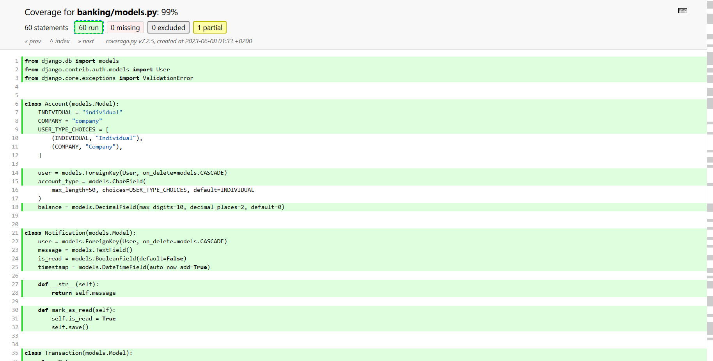

# Bankly

Welcome to the Bankly project! This is a university project focused on software testing. The project is a simple banking system that includes functionalities like user registration, user login, account creation, and transactions.

The project uses the Test-Driven Development (TDD) approach. Each functionality is first covered by tests, and then the implementation is done to make the tests pass. This ensures that all code is covered by tests and works as expected.

**You can jump over to the [testing section](#testing)**

## Installation

To install this project, you need to have Python 3.10 and Poetry installed on your machine. Poetry is a tool for dependency management and packaging in Python.

You can install Poetry using the following command:

```bash
curl -sSL https://install.python-poetry.org | python -
```

After installing Poetry, you can clone the project and install the dependencies using the following commands:

```bash
git clone https://github.com/mustafausama/bankly.git
cd bankly
poetry install
cd client
npm install
```


## Required Packages

The project requires the following packages:

- Django
- Django REST framework
- Django REST framework SimpleJWT
- Coverage
- Django CORS headers
- drf-yasg
- Django Log Viewer

These packages are listed in the `pyproject.toml` file and will be installed by Poetry.

## Project Structure

The project is divided into two main apps: `banking` and `authentication`. The `banking` app handles the banking functionalities like account creation and transactions, while the `authentication` app handles the user registration and login functionalities.

## Testing

The project includes unit tests, integration tests, and a "Big Bang" integration test. The tests cover all the functionalities of the project.

- The unit tests test individual components in isolation.
- The integration tests test the interaction between different components.
- The "Big Bang" integration test tests multiple functionalities in a single test.

You can find detailed descriptions of the tests in the following README files:

- [Banking Tests](banking/TESTS.md)
- [Authentication Tests](authentication/TESTS.md)
- [Big Bang Integration, Performance, and Load Tests](TESTS.md)

## Running the Tests

To run the tests, you can use the following command to run the tests:

```bash
poetry run python manage.py test
```

To run the tests while including the branch coverage:

```bash
poetry run coverage run --branch manage.py test
```

Either of these two commands will run all the tests in the project.


To generate the test coverage report, you can use the following command that generates the report in the console:

```bash
poetry run coverage report --skip-empty --omit=manage.py,admin.py
```


To generate the test coverage report, you can use the following command that generates the report in the test-coverage folder in an html format (the command ignores all manage.py and admin.py files as they are used by the server admin and are not tested):

```bash
poetry run coverage html -d test-coverage -i --omit=manage.py,admin.py
```


You can check the coverage details of each file by clicking on any of them, as follows (e.g. `banking/models.py`):



## Running

To run the backend server in DEBUG mode, you can run the following command:

```bash
poetry run python manage.py runserver
```

To run the frontend in DEBUG mode, you can run the following command in the `client` folder (`cd client`):

```bash
npm start
```

## Contributing

If you want to contribute to this project, you can create a new branch, make your changes, and then create a pull request. Please make sure to add tests for any new functionalities.

## License

This project is licensed under the MIT License.

## Contact

If you have any questions or suggestions, please feel free to contact us.

Thank you for visiting our project!