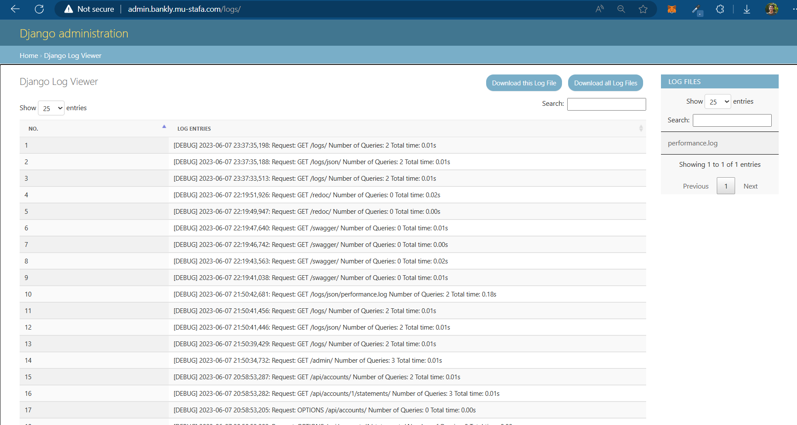
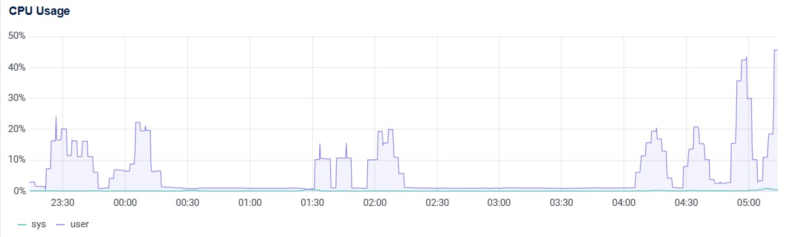
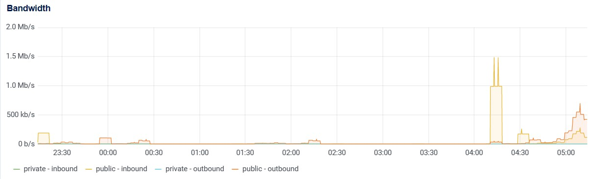
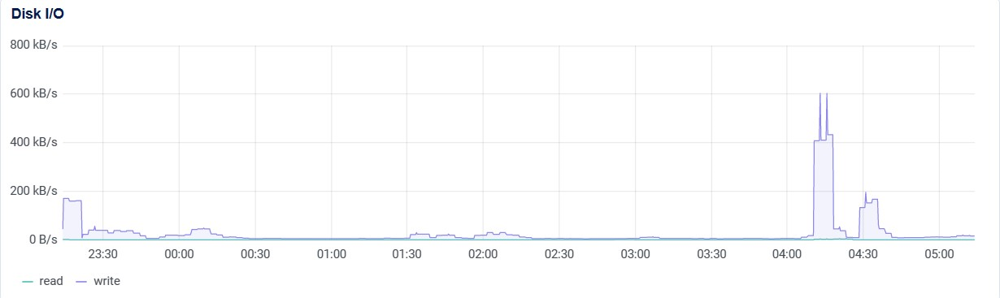
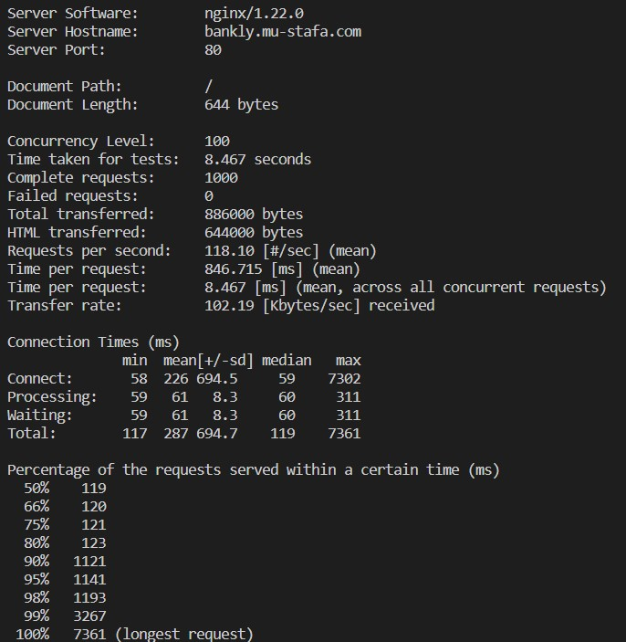
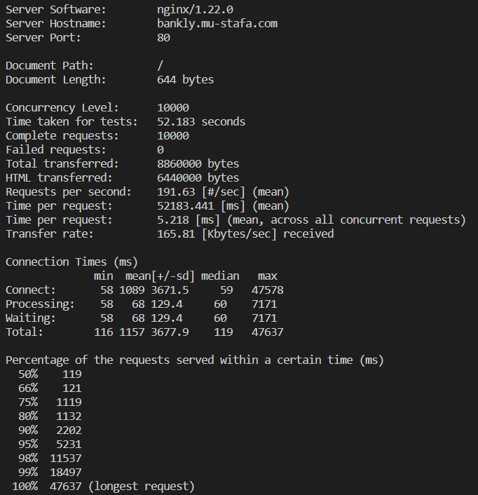
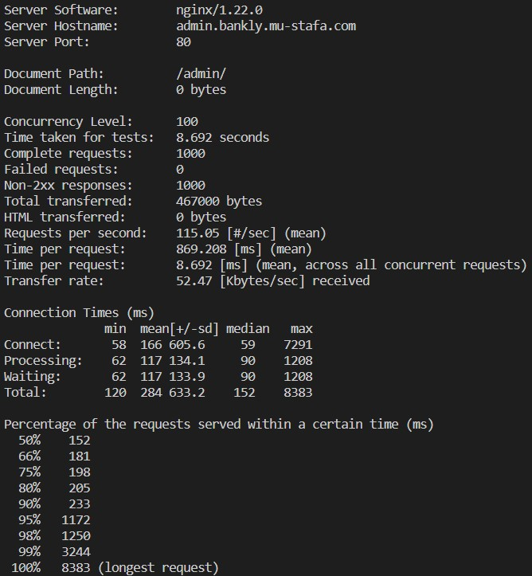
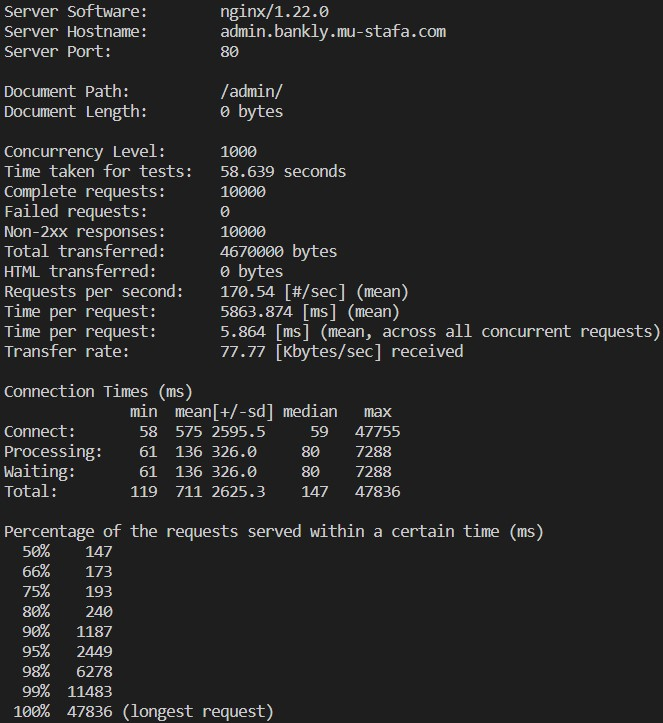
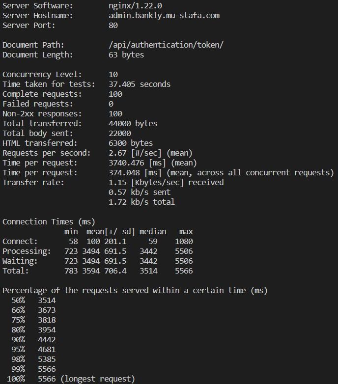
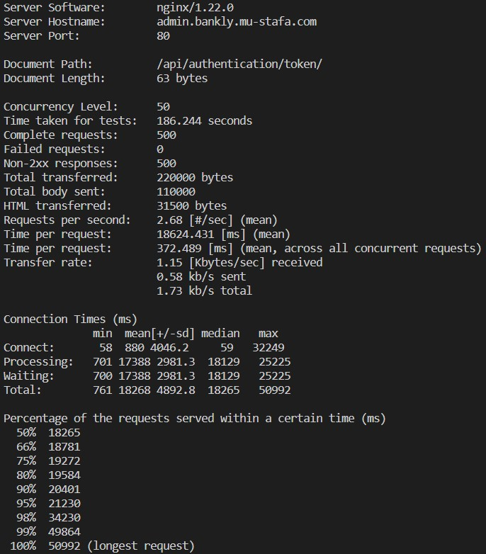

# TESTS

This project uses Test-Driven Development (TDD) approach. Each functionality is first covered by tests, and then the implementation is done to make the tests pass. This ensures that all code is covered by tests and works as expected.

You can find detailed descriptions of the other unit tests in the following README files:

- [Banking Tests README](banking/TESTS.md)
- [Authentication Tests README](authentication/TESTS.md)

## Test Classes

### BigBangIntegrationTest

This class tests the integration of multiple functionalities in a single test, often referred to as a "Big Bang" integration test.

- `test_big_bang`: This method tests the following functionalities in sequence:
  - User Registration: It tests the registration of a new user and expects a successful response with the username.
  - User Login: It tests the login of the registered user and expects a successful response with an access and refresh token.
  - User Refresh Login: It tests the refresh login functionality using the refresh token and expects a successful response with a new access token.
  - Create Account: It tests the creation of an account and expects a successful response with the account type.
  - Hard-update balance: It updates the balance of the created account to 1000 using the ORM and expects the updated balance to be 1000.
  - Create Transaction: It tests the creation of a withdrawal transaction and expects a successful response.
  - Check Account list: It tests the retrieval of the account list and expects a list with one account with a balance of 500.
  - Check Bank Statement: It tests the retrieval of the bank statement and expects a statement with one transaction of type 'withdrawal' and amount 500.
  - Check Unread Notifications: It tests the retrieval of unread notifications and expects one notification with a message about the transaction.

## Performance and Load testing
For the performance testing, a performance log middleware is added that, for each API request, logs the following:
- The date and time (including milliseconds)
- Request method (GET, POST, ...)
- Request endpoint
- Number of database queries used
- Total time taken (since receving the request until generating a response)  

The logs can be accessed by following the endpoint: `http://ADMIN_HOST/logs/` and clicking to select the performance.log file on the right, as follows:

The CPU, Network Bandwidth, and disk I/O are monitored to check performance for every given perid of time, as follows:

The load testing is done using the [Apache HTTP Benchmarking Tool](https://httpd.apache.org/docs/2.4/programs/ab.html) tool. The load testing scripts are as follows with outputs.

### Frontend
| Load Test Description | Bash File (adjust parameters) | Output |
| - | - | - |
| 1000 total requests with 100 of them concurrent at a time | [Load-Frontend-Stateless](load-testing/load-frontend-stateless.sh) |  |
| 10000 total requests with 10000 of them concurrent | [Load-Frontend-Stateless](load-testing/load-frontend-stateless.sh) |  |

### Backend Stateless
| Load Test Description | Bash File | Output |
| - | - | - |
| 1000 total requests with 100 of them concurrent at a time.  *This tests a backend stateless endpoint with no database queries.* | [Load-Backend-Stateless](load-testing/load-backend-stateless.sh) |  |
| 10000 total requests with 1000 of them concurrent at a time.  *This tests a backend stateless endpoint with no database queries.* | [Load-Backend-Stateless](load-testing/load-backend-stateless.sh) |  |

### Backend With Database Queries
| Load Test Description | Bash File | Output |
| - | - | - |
| 100 total requests with 10 of them concurrent at a time.  *This tests a backend endpoint that executes database queries.* | [Load-Backend-DB](load-testing/load-backend-db.sh) |  |
| 500 total requests with 50 of them concurrent at a time.  *This tests a backend endpoint that executes database queries.* | [Load-Backend-DB](load-testing/load-backend-db.sh) |  |

